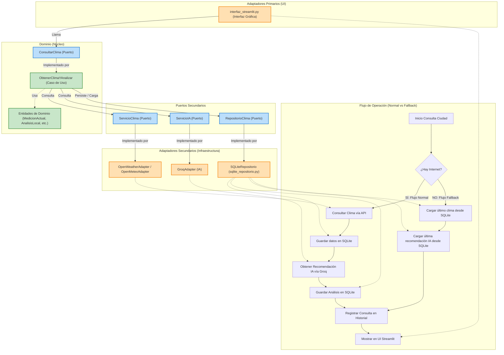

# Sistema Inteligente de Apoyo Agrícola - SIA Nicaragua

El Sistema Inteligente de Apoyo Agrícola (SIA) es una solución tecnológica avanzada diseñada para la gestión y soporte de decisiones en el sector agropecuario de Nicaragua. Este sistema integra el análisis de datos meteorológicos en tiempo real con capacidades de Inteligencia Artificial para ofrecer recomendaciones precisas sobre ciclos de siembra, gestión de riesgos y monitoreo climático.

## Descripción del Proyecto

El SIA Nicaragua ha sido desarrollado como una herramienta modular que permite a los productores y técnicos agrícolas visualizar el estado actual y futuro del clima en diversos municipios del país. La plataforma no solo muestra datos crudos, sino que los procesa a través de un motor de lógica agronómica para determinar si las condiciones son favorables para cultivos específicos, como granos básicos (maíz y frijol).

## Estructura de Directorios

```text
ProyectoExamenSismos/
├── dominio/                     # Núcleo de la aplicación (Hexágono)
│   ├── entidades.py             # Modelos de negocio (MedicionActual, AnalisisLocal, etc.)
│   ├── puertos.py               # Interfaces abstractas (ServicioClima, RepositorioClima, ServicioIA)
│   ├── estadisticas.py          # Cálculo de métricas climáticas
│   ├── excepciones.py           # Excepciones personalizadas de dominio
│   └── consultar_y_analizar_clima.py   # Lógica de negocio orquestada (ObtenerClimaYAnalizar)
├── adaptadores/
│   ├── primarios/
│   │   └── interfaz_streamlit.py # Interfaz de usuario (Streamlit)
│   └── secundarios/
│       ├── api/
│       │   ├── openmeteo_adaptador.py    # API Open-Meteo (gratuita, sin llave)
│       │   ├── openweather_adaptador.py  # API OpenWeatherMap
│       │   └── groq_adaptador.py         # IA Groq (Llama 3) para recomendaciones
│       └── persistencia/
│           └── sqlite_repositorio.py   # SQLite con mappers, migraciones, CHECKs y purga
├── ensamblaje/
│   └── contenedor.py           # Composition Root (crea instancias y realiza inyección de dependencias)
├── configuracion/
│   └── ajustes.py              # Configuración (API keys, umbrales, ciudades)
├── app.py                      # Entry point delgado (< 10 líneas)
├── estilos/                    # Estilos visuales CSS
│   └── estilos.css
├── utilidades/                 # Herramientas de utilidad
│   └── generador_pdf.py        # Generación de reportes PDF (Diagnóstico/Estadístico)
└── data_backup.db              # Base de datos SQLite (esquema físico)
```

## Arquitectura del Sistema - Hexagonal (Puertos y Adaptadores)

El proyecto sigue la **Arquitectura Hexagonal** (también llamada de Puertos y Adaptadores) propuesta por Alistair Cockburn, que aísla la lógica de negocio de la infraestructura exterior para que pueda evolucionar sin acoplamiento tecnológico.

### Diagrama de la Arquitectura y Flujos (Normal vs Fallback)



### Capas:

- **Dominio (el Hexágono)**: Contiene las entidades del negocio, los puertos (interfaces abstractas) y los casos de uso. Está completamente aislado de la infraestructura (no importa `requests`, `sqlite3` ni Streamlit).
  - `entidades.py`: `MedicionActual`, `PronosticoDia`, `DatosClima`, `AnalisisLocal`, `ResultadoConsulta`, `ConsultaHistorial`
  - `puertos.py`: `ServicioClima`, `ServicioIA`, `RepositorioClima`, `ConsultarClima` (todos interfaces abstractas ABC)
  - `consultar_y_analizar_clima.py`: `ObtenerClimaYAnalizar` - orquesta el flujo de negocio sin depender de librerías externas.

- **Adaptadores Secundarios (Infraestructura de salida)**: Implementan los puertos con tecnologías concretas.
  - `openmeteo_adapter.py` / `openweather_adapter.py`: Conexiones REST con APIs meteorológicas.
  - `groq_adapter.py`: Integración con Groq API para análisis mediante IA.
  - `sqlite_repositorio.py`: Persistencia física relacional. Implementa un mapeador (Mapper) que traduce entre el modelo físico en español y las entidades del dominio con nombres en inglés.

- **Adaptadores Primarios (Infraestructura de entrada)**: Interfaz de usuario o desencadenadores externos.
  - `interfaz_streamlit.py`: UI interactiva en Streamlit. Consume el puerto `ConsultarClima`.

- **Composition Root (`ensamblaje/contenedor.py`)**: Único lugar del código donde se configuran e instancian las implementaciones de los adaptadores y se inyectan a los casos de uso.

### Principio de Inversión de Dependencias (DIP):
El dominio no depende de la infraestructura; la infraestructura depende de las interfaces abstractas definidas en el dominio.

## Base de Datos SQLite

La base de datos relacional está optimizada en español para garantizar normalización, consistencia de datos y rendimiento, aplicando principios SOLID y de base de datos relacional.

### Estructura del Esquema (6 Tablas + Control de Versiones):

| Tabla | Propósito | Características Clave |
|-------|-----------|-----------------------|
| `_migrations` | Control de versiones de base de datos. | Registra la versión y la fecha de aplicación del esquema. |
| `ciudades` | Catálogo de municipios con coordenadas. | Clave primaria en `nombre`, CHECK para el booleano `es_agricola`. |
| `clima_actual` | Último clima medido por ciudad (relación 1:1 con ciudad). | `ciudad` UNIQUE, CHECK de rangos de temperatura (-50 a 60°C), humedad (0 a 100%), precipitación (>= 0), formato de fecha ISO 8601. |
| `analisis_clima` | Análisis generado (combinación de análisis local e IA). | Relación 1:1 con `clima_actual` mediante `clima_actual_id UNIQUE` con `ON DELETE CASCADE`. CHECK para estado (`URBAN`, `NORMAL`, `FAVORABLE`, `RIESGOSO`). |
| `clima_pronostico` | Pronóstico de 5 a 7 días por ciudad (relación 1:N). | Clave única combinada `UNIQUE(ciudad, fecha)`, CHECK de formatos e integridad referencial a ciudades. |
| `historial_consultas` | Registro histórico de consultas del usuario. | Poblado directamente desde la capa de aplicación/caso de uso para mantener las reglas de negocio en el dominio y evitar triggers complejos. |
| `log_auditoria` | Auditoría de eventos del sistema (log). | CHECK en operación (`INSERT`, `UPDATE`, `DELETE`), campos de `usuario` y `direccion_ip`. Se alimenta con el trigger `trg_log_analisis` al guardar nuevos análisis. |

### Características Técnicas de la Base de Datos:
1. **Integridad Referencial Estricta**: Activación explícita y verificación de `PRAGMA foreign_keys = ON;` en cada conexión.
2. **Restricciones CHECK**: Todo control de rango (temperatura, humedad, formatos ISO de fecha, estados válidos) se valida a nivel físico mediante CHECKs en SQLite.
3. **Triggers Desacoplados**: Se eliminaron los triggers que contenían lógica de negocio (`trg_validar_humedad` y `trg_auditar_consulta`), moviéndola al dominio. Se mantiene el trigger técnico `trg_log_analisis` para poblar el log de auditoría.
4. **Estrategia de Purga**: Limpieza automática al guardar nuevos climas para evitar el crecimiento descontrolado de la base de datos (se mantienen 10 días de pronóstico, 90 días de historial de consultas y 365 días de logs).
5. **Transacciones Atómicas**: Uso de `BEGIN TRANSACTION` / `COMMIT` / `ROLLBACK` para asegurar la atomicidad de las escrituras complejas.

## Funcionalidades y Modo Offline

- **Detección Automática**: El sistema evalúa la disponibilidad de red al iniciar la consulta.
- **Online**: Obtiene clima en tiempo real, genera recomendaciones agronómicas con Llama 3 en Groq, y guarda todo en el nuevo esquema normalizado.
- **Offline**: Recupera los últimos datos climáticos y las recomendaciones de IA guardadas localmente de forma transparente.

## Instrucciones de Instalación y Uso

1. Instalar dependencias requeridas (Streamlit, Pandas, Plotly, requests).
2. Ejecutar la aplicación:
   ```bash
   streamlit run app.py
   ```
3. Seleccione una ciudad del panel lateral y presione **Analizar Clima**.
4. Use el botón **Historial de Consultas** para ver la auditoría de búsquedas anteriores.
5. Use el **Chat Experto** en el panel inferior para interactuar con la IA en modo online.
